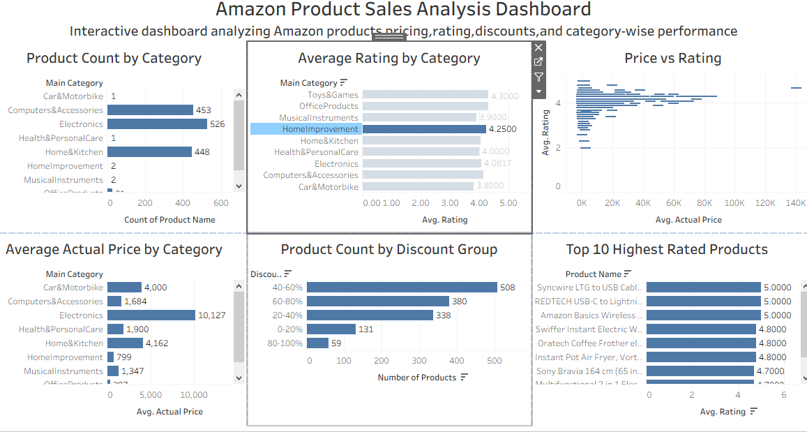

# 🛍️ Amazon Product Sales Analysis using Python,SQL & Tableau

> End-to-End Data Analysis Project using Python, SQL, Tableau and GitHub.


---

##  Project Overview

This project analyzes Amazon product sales data using **Python, MySQL, and Tableau**. The dataset was cleaned, transformed, analyzed, and visualized to identify pricing trends, customer ratings, discounts, and category-wise performance.

The project demonstrates a complete Data Analysis workflow from raw data to an interactive dashboard.

##  Dataset Information

The dataset contains Amazon product information, including:

- Product Name
- Category
- Actual Price
- Discounted Price
- Discount Percentage
- Product Rating
- Rating Count
- Product Reviews

---

# Objectives

- Clean and preprocess Amazon product data.
- Perform Exploratory Data Analysis (EDA).
- Analyze product ratings, pricing, and discounts.
- Write SQL queries for business analysis.
- Build an interactive Tableau dashboard.
- Present meaningful business insights.

---

# Tools & Technologies

- Python
- Pandas
- NumPy
- Matplotlib
- Jupyter Notebook
- MySQL
- Tableau Public
- Git & GitHub

---

#  Project Structure

```text
Amazon-Data-Analysis/
│
├── data/
│   ├── raw/
│   ├── cleaned/
│   └── processed/
│
├── notebooks/
│   └── Amazon_Data_Analysis.ipynb
│
├── sql/
│   └── amazon_analysis.sql
│
├── tableau/
│   └── Amazon_Tableau_Dashboard.twbx
│
├── images/
│   └── dashboard.png
│
├── README.md
├── requirements.txt
├── LICENSE
└── .gitignore
```

---

#  Project Workflow

1. Data Collection
2. Data Cleaning
3. Data Preprocessing
4. Exploratory Data Analysis (EDA)
5. SQL Analysis
6. Tableau Dashboard
7. Business Insights

##  How to Run the Project

1. Clone this repository.
2. Install the required libraries.
```bash
pip install -r requirements.txt
```
3. Open the Jupyter Notebook.
4. Run all cells.
5. Open the Tableau workbook to view the dashboard.

---

# Dashboard Preview

The dashboard provides interactive insights into Amazon product pricing, ratings, discounts, and category-wise performance.


Project Overview
↓
Dataset
↓
Objectives
↓
Tools
↓
Workflow
↓
How to Run
↓
Dashboard Preview
↓
Key Insights
↓
SQL Analysis
↓
Future Improvements
↓
Skills
↓
Author

---

##  Key Insights

- Electronics and Computer Accessories contain the highest number of products.
- Most products have ratings above 4.0.
- Several products offer discounts greater than 50%.
- Product prices vary significantly across categories.
- Highly rated products generally receive more customer reviews.

---

# SQL Analysis

The project includes SQL queries for:

- Product count
- Average rating
- Category-wise analysis
- Discount analysis
- Top-rated products
- Pricing insights

---

# Future Improvements

- Interactive Power BI Dashboard
- Predictive Analysis using Machine Learning
- Customer Review Sentiment Analysis
- Sales Forecasting
- Automated Data Pipeline

---
## Skills Demonstrated

- Data Cleaning
- Data Preprocessing
- Exploratory Data Analysis (EDA)
- SQL Query Writing
- Data Visualization
- Dashboard Development
- Business Insight Generation

---

# Author

**Sudhamani Yalamanchi**

Final Year B.Tech (Computer Science & Engineering)

Aspiring Data Analyst

Skills: Python | SQL | Tableau | Excel | Git | GitHub

---

## ⭐ If you found this project useful, please consider giving it a star!
